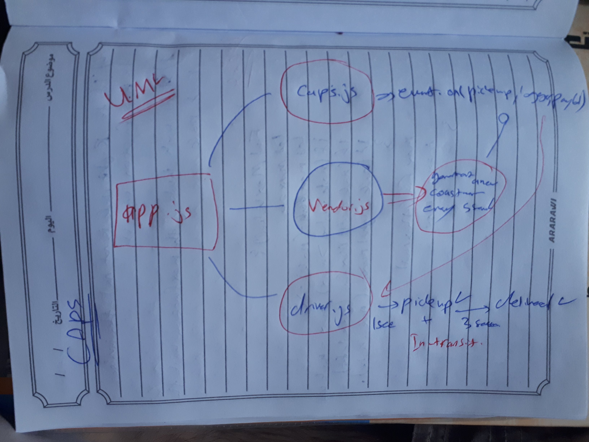

# CAPS
Week 4 in 401-Java-Scripts.

## Author: Ahamd Mamdouh AlHabrawi

## Links and Resources
[Repo](https://github.com/401-advanced-javascript-AhmadMamdouh/CAPS.git)

## Setup
.env requirements
* STORE_NAME=mamdouh

## How to initialize/run this application
* node app.js

## Tests
* npm run lint
* npm test

### UML
